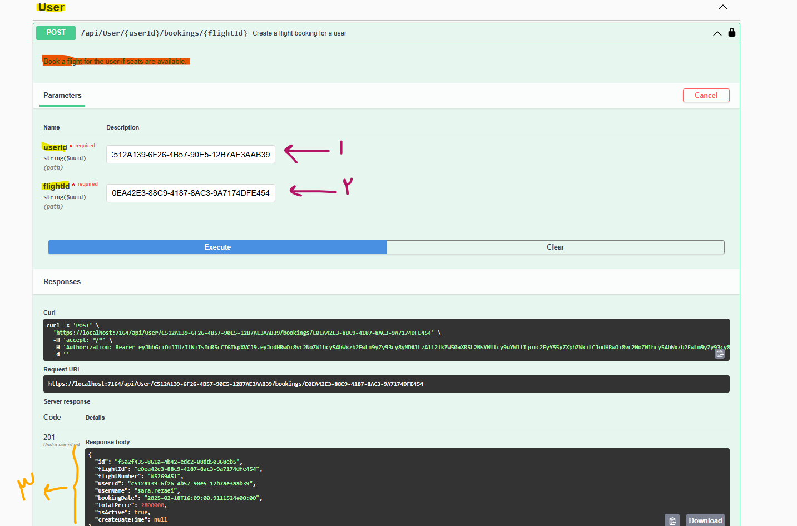

# Flight Booking System API

This is a RESTful API for a Flight Booking System, designed to manage flight bookings, users, and flights. The API supports operations such as booking flights, viewing booking history, and managing user information.

## Features

- **Flight Booking**: Users can book flights if there are available seats.
- **Booking Cancellation**: Users can cancel their bookings, and available seats will be updated accordingly.
- **Booking History**: Users can view their booking history.
- **User Info**: Users can view and update their personal information.

## Tech Stack

- **.NET 8**
- **Entity Framework Core** with **SQL Server**
- **Swashbuckle for Swagger documentation**
- **JWT Authentication** for secure endpoints

## Getting Started

### Prerequisites

1. **Install .NET 8  SDK**: You will need .NET 8 SDK to run this project.
   - Download and install 

2. **SQL Server**: This project uses a local SQL Server database. Ensure that SQL Server is running and accessible.


### Setting Up

1. **Clone the repository**:
   ```bash
   git clone <repository-url>
   cd <project-directory>
   ```

2. **Setup Local Database**:
   - The project uses a local SQL Server instance. Make sure your connection string in `appsettings.Development.json` points to the correct instance.
   - Ensure that your local database is created and set up. The application will automatically apply migrations if they are not already in place.

3. **Add Initial Data**:
   - The database has been pre-populated with 10 entries for each table. You can check or modify them if needed.

4. **Run the Application**:
   - Build and run the project:
     ```bash
     dotnet build
     dotnet run
     ```

5. **Authenticate**:
   - To interact with the API, you must authenticate first.
   - 


))


6. **Use the JWT Token**:
   - Once you have the token, add it as a Bearer token in the **Authorization** header to call protected endpoints.

   Example:
   
   

### Available Endpoints


#### 1. **User Registration**
   - Description: Registers a new user with their details.

#### 2. **Create a Booking**
   - Description: Creates a new flight booking for a user.


#### 3. **View Booking History**
   - Description: Retrieves all bookings made by the user.


#### 4. **Get User Info**
   - Description: Retrieves the user’s information.


#### 5. **Cancel a Booking**
   - Description: Cancels a flight booking for the user.


## Notes

- The system uses a **local SQL Server** database, and the initial data has been pre-populated with 10 entries in each table for testing.
- Ensure the **JWT Authentication** is successfully performed to access any restricted endpoints.
- The system works in **development** mode, and further configurations are needed for **production** use.
